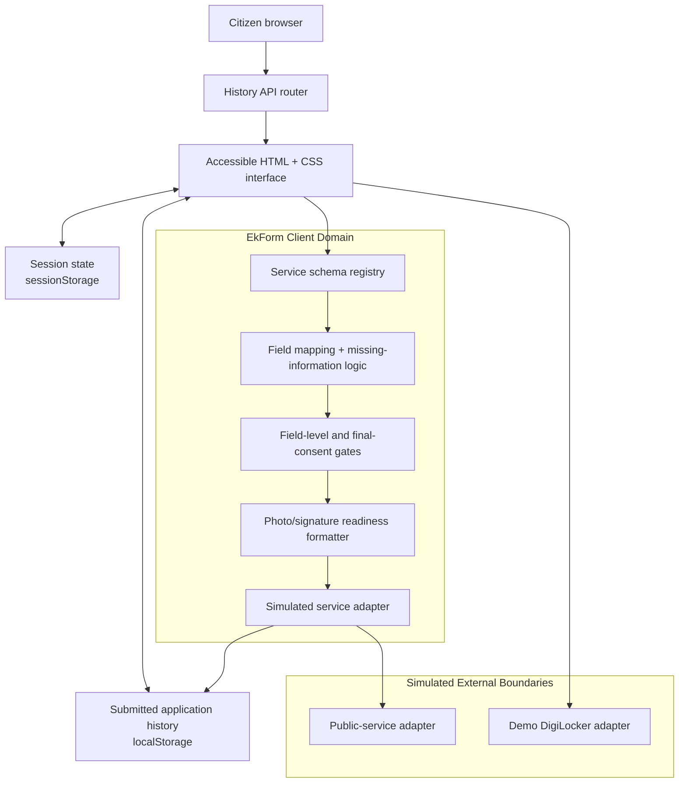

# EkForm

> **Fill once. Format automatically. Apply anywhere.**

EkForm is a citizen-first public-service application preparation platform. It demonstrates how a reusable citizen profile and consent-approved, verified documents can be converted into the exact fields, uploads and formats required by different public-service applications.

This repository is a hackathon prototype. Every identity, OTP, DigiLocker document, government-service submission, payment, acknowledgement and status is **synthetic or simulated**. It never uses live Aadhaar, PAN, OTP, DigiLocker, payment or government-system data.

## The problem

Citizens repeatedly enter the same personal details, upload the same documents and struggle with different portal rules for every application. A photo, signature or PDF that is valid for one service may fail on another because the accepted file format, dimensions and size limits differ.

EkForm acts as an interoperability layer between:

- a citizen account and reusable preferences;
- consent-approved verified-document data;
- service-specific form schemas and document rules; and
- a public-service submission adapter.

The citizen stays in control: no information is prepared or shared before field-level and final consent.

## Core citizen journey


## System architecture



## Current implementation

### Supported complete services

| Service | End-to-end journey | Special rules demonstrated |
| --- | --- | --- |
| Income Certificate | Yes | Field mapping, address conflict, photograph correction, consent, receipt and tracking |
| Scholarship Application | Yes | Reuses the same demo profile, educational certificate, photograph correction and signature correction |

Community Certificate and Senior Citizen Travel Concession appear as clearly labelled demo previews. Their service-adapter schemas can be added without changing the core workflow engine.

### Service-schema model

The application does not ask an AI model to invent exact document restrictions. Exact rules are defined in a structured schema first.

```js
{
  id: "scholarship-application",
  service: "Scholarship Application",
  totalFields: 19,
  fields: [
    "full_name",
    "date_of_birth",
    "current_address",
    "education_certificate",
    "current_course",
    "institution_name",
    "annual_income"
  ],
  documents: [
    "identity_proof",
    "education_certificate",
    "address_proof",
    "photograph",
    "signature"
  ],
  photoRequirements: {
    format: ["jpg", "jpeg"],
    width: 413,
    height: 531,
    maxSizeKB: 50
  },
  signatureRequirements: {
    format: ["jpg", "jpeg"],
    width: 140,
    height: 60,
    maxSizeKB: 30
  }
}
```

This separation is important: the schema controls deterministic requirements, while an AI-capable form-understanding layer can help interpret unfamiliar field labels and explain questions in plain language.

### Simulated adapters

The prototype uses explicit adapter boundaries:

```text
Demo DigiLocker adapter
  - requests selected synthetic document categories
  - returns a short-lived mock token
  - token is revoked on signout

Simulated service adapter
  - validates consent and required document count
  - accepts a prepared mock payload
  - generates an acknowledgement reference
```

This lets the user experience a full integration flow without accessing a real government system.

## Consent model

EkForm uses three consent gates:

1. **Document-source consent** — choose which synthetic document categories the Demo DigiLocker may share.
2. **Field-level consent** — choose which fields EkForm can use for the selected application.
3. **Final sharing consent** — confirm accuracy, understand the simulated submission and approve the selected payload.

All final-consent checkboxes are intentionally unchecked by default.

## Routes

| Route | Purpose |
| --- | --- |
| `/` | Public landing page, connected-platform visual and workflow explainer |
| `/signin` | Demo sign-in path |
| `/signup` | Demo account setup path |
| `/verify-otp` | Mock OTP verification (`123456`) |
| `/onboarding` | Three-screen product onboarding |
| `/connect-documents` | Demo DigiLocker document consent |
| `/dashboard` | Demo User dashboard and service selection |
| `/services/income-certificate` | Income Certificate overview |
| `/services/scholarship-application` | Scholarship Application overview |
| `/applications/new/*` | Plan, consent, autofill, conflict, questions, documents, review, consent and success states |
| `/applications/:id` | Simulated application tracking |
| `/privacy` | Connected documents, saved data and consent history |

The app uses the browser History API. A production deployment needs an SPA fallback rewrite so direct visits to these routes serve `index.html`.

## Demo credentials

All access paths resolve to the same temporary profile:

```text
Profile: Demo User
Mobile: 9876543210
PIN: 1234
Mock OTP: 123456
```

`Try Demo` skips account setup and opens the Demo User dashboard directly. Sign-in, signup and mock OTP also resolve to this same demo-only account.

## Project structure

```text
india/
├── index.html            # Vite entry document
├── enterprise-app.js     # Router, state model, schemas, adapters and UI rendering
├── app.js                # Earlier prototype implementation retained for reference
├── styles.css            # Design tokens, responsive layout and accessibility styles
├── hero-india.png        # Landing-page hero asset
├── journey-india.png     # Landing-page CTA asset
├── ekform-logo.png       # EkForm logo asset
├── package.json
└── README.md
```

## Local development

### Prerequisites

- Node.js 18 or newer
- npm

### Run locally

```bash
npm install
npm run dev
```

Vite prints a local preview URL, usually `http://localhost:5173`.

### Production build

```bash
npm run build
```

The generated static output is placed in `dist/`.

## Accessibility and responsive behaviour

- Semantic headings, lists, buttons, labels and form controls are used across the product.
- Workflow steps are buttons and can be selected using a keyboard.
- Connected-platform modules support keyboard focus and tooltips.
- Visible focus states are present for interactive controls.
- `prefers-reduced-motion` reduces nonessential transitions and workflow animation.
- Connected-platform layout adapts from a central desktop diagram to tablet columns and a mobile sequence.
- The seven-step workflow adapts from horizontal desktop rail to tablet grid and a vertical mobile timeline.

## Security and privacy boundaries

This is not a live government product. It is intentionally safe for a hackathon demonstration.

- No live Aadhaar, PAN, personal documents, mobile OTPs or payment details are used.
- No live government portal is accessed, scraped or submitted to.
- Browser session state uses synthetic values only.
- Submitted synthetic application history is retained locally only to demonstrate tracking and consent history.
- Signout clears temporary session state and revokes the mock document-access token while preserving submitted mock history.

## Production integration roadmap

Before a production rollout, EkForm would require:

1. Approved DigiLocker requester integration and appropriate consent artefacts.
2. Department-approved public-service APIs or form-adapter agreements for every supported service.
3. Server-side authentication, encrypted storage, key management and short-lived access tokens.
4. Immutable consent/audit logs, retention rules and data-deletion controls.
5. DPDP-aligned privacy processes, security assessment, threat modelling and incident response.
6. Accessibility audits, multilingual content review, service availability monitoring and rate limiting.
7. A real image/PDF transformation service with malware scanning, metadata stripping and deterministic validation.

## Submission positioning

> **DigiLocker stores verified documents. EkForm uses consent-approved information to understand, prepare and submit supported public-service forms.**

EkForm is best described as a **UPI-like interoperability layer for forms**: connect once, fill once and apply across supported public-service platforms.

